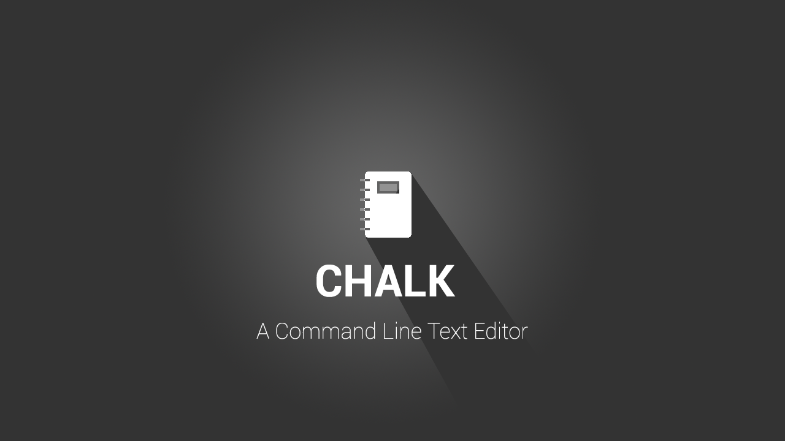

.. Chalk documentation master file, created by
   sphinx-quickstart on Wed Sep  6 23:49:05 2017.
   You can adapt this file completely to your liking, but it should at least
   contain the root `toctree` directive.

Welcome to Chalk's documentation!
=================================

Contents:

This is introduction to Chalk.
Chalk is mainly a command line text editor developed by Bytes Club 
under the mentorship of Rudra Nil Basu.
Here we are going to discuss the basic git features .

.. toctree::
   :maxdepth: 2
   :caption: Contents:

.. toctree::
   :maxdepth: 2

   getting_started
   setting_up
   sending_patches

Indices and tables
==================

* :ref:`genindex`
* :ref:`modindex`
* :ref:`search`

